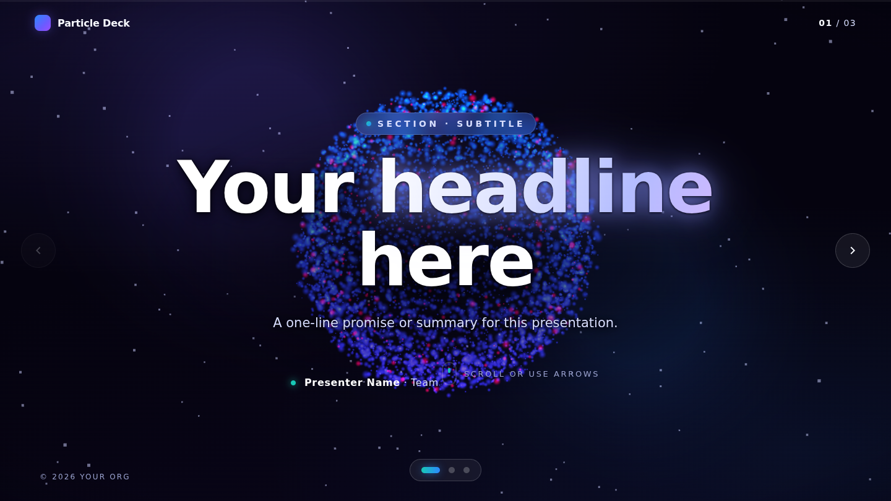
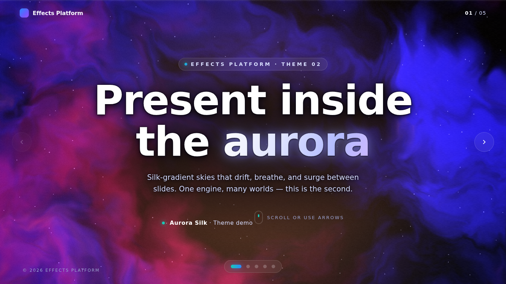
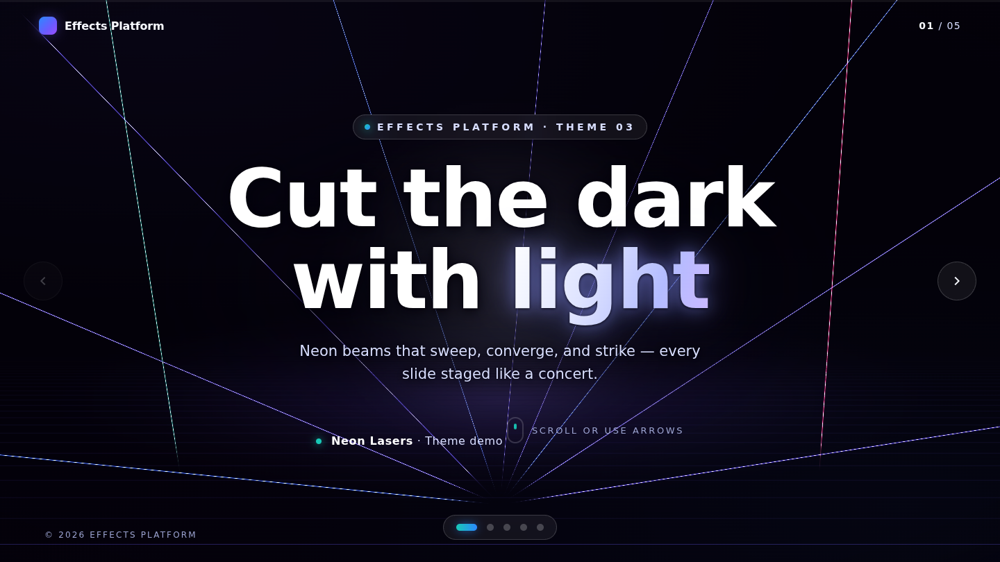
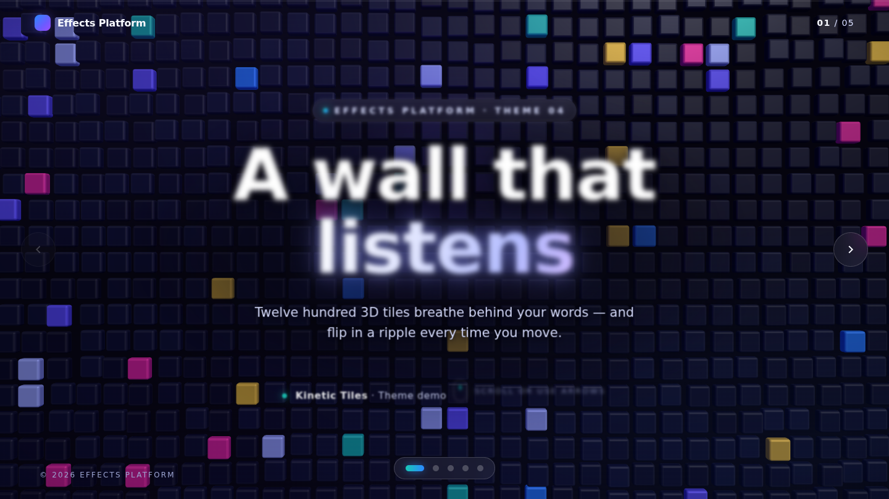
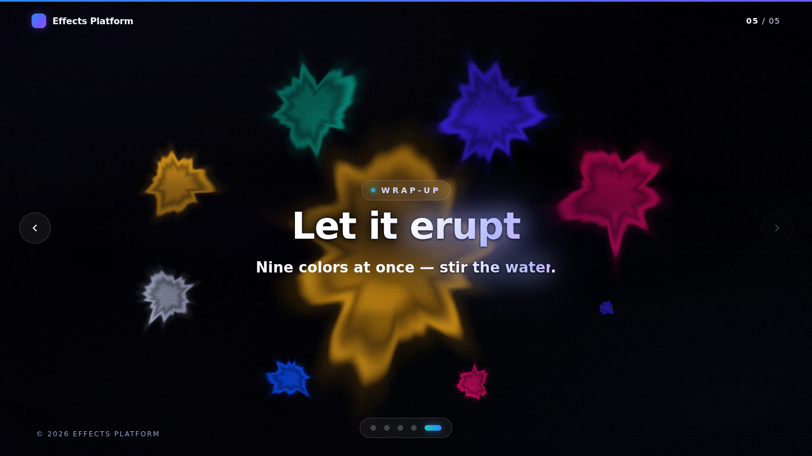

# Effects Platform — themeable 3D presentation engine

A presentation platform where the deck's background is a **live WebGL world**.
One shared engine drives navigation, Framer-style reveals, and transition
choreography; pluggable **themes** render the world behind the slides and morph
it on every slide change. Zero build, zero runtime network — Three.js + GSAP
are vendored, and decks deploy as-is to GitHub Pages.

| Cosmos (particles) | Aurora (silk gradients) |
|---|---|
|  |  |

## Themes

| Theme | Look | Scene vocabulary | Status |
|---|---|---|---|
| **Cosmos** | ~13k GPU particles morphing between formations, whirlwind transitions | `orb · core · core-center · clusters:N · split · ring · grid · stream · burst` | ✅ shipped |
| **Aurora** | domain-warped silk-gradient skies that drift and surge | `dawn · drift · veil · dusk · nova` | ✅ shipped |
| **Neon Lasers** | a pooled fleet of neon beams staged like a concert, flash-synced transitions | `gate · pillars:N · sweep · tunnel · weave · strike` | ✅ shipped |
| **Kinetic Tiles** | 1,200 instanced 3D tiles that ripple-flip and re-paint between slides | `wall · wave · columns:N · checker · spiral · cascade` | ✅ shipped |
| **Liquid Ink** | luminous ink splats that bloom, bleed, and dissolve in dark water | `drop · bloom:N · wash · collide · torrent · eruption` | ✅ shipped |

| Lasers | Tiles | Ink |
|---|---|---|
|  |  |  |

**Demos:** root `index.html` is the Cosmos template deck; each theme has a
showcase in [`decks/`](decks/) (`aurora-demo`, `lasers-demo`, `tiles-demo`,
`ink-demo`) generated from Deck IR by the composer — the IR source sits next
to each deck as `deck.json` (aurora's is
[`platform/compose/example-deck.json`](platform/compose/example-deck.json),
doubling as the schema example).

## Make a deck

```bash
git checkout -b deck/<your-deck-name>
python3 -m http.server 8000     # preview at http://localhost:8000
```

**Author in HTML** — duplicate a slide `<section>`, pick a scene, write content
(full guide: **[AUTHORING.md](AUTHORING.md)**):

```html
<section class="slide content" data-scene="clusters:3">
  <div class="slide-inner"> … your content … </div>
</section>
```

Omit `data-scene` and the theme art-directs the slide from its content
(cover → hero scene, N cards → clusters, pipeline → stream, …).

**Or author in JSON (Deck IR)** and let the composer build the page
(schema: **[platform/compose/schema.md](platform/compose/schema.md)**):

```bash
node platform/compose/build-deck.mjs my-deck.json decks/my-deck/index.html
```

**Or upload a PowerPoint.** Open **[`studio/`](studio/)** in a served repo
(e.g. `http://localhost:8000/studio/`), drop a `.pptx`, pick a theme, and
download the result — parsing, art direction, and composition all run in the
browser; the file never leaves your machine. The same pipeline runs headless:

```bash
node platform/ingest/ingest-pptx.mjs talk.pptx decks/talk/deck.json aurora
node platform/compose/build-deck.mjs decks/talk/deck.json decks/talk/index.html
```

Ingestion re-expresses content rather than replicating layout: 2–4 short
bullets become glass cards, 5–8 become numbered moves, prose becomes ledes,
embedded images become framed media, "thank you" slides become finales, and
each theme art-directs the scenes. Try it with
[`docs/samples/atlas-review.pptx`](docs/samples/atlas-review.pptx) — the
result is committed at [`decks/pptx-demo/`](decks/pptx-demo/).

## Ship it

Three ways out of the platform (all in Studio, all also headless):

- **Single-file HTML** (~2 MB) — everything inlined: CSS, GSAP, the engine,
  the theme, and Three.js riding in a `data:` URI import map. Double-click it,
  email it, drop it on any host; works offline and even from `file://`.
  ```bash
  node platform/export/export-single.mjs decks/talk/deck.json talk.html
  ```
- **Bundle (.zip)** — unzips to a folder (`index.html` + engine + vendor) that
  runs on any static host.
  ```bash
  node platform/export/export-bundle.mjs decks/talk/deck.json talk.zip
  ```
- **Deploy to GitHub Pages** (beta) — Studio creates the repo, uploads the
  bundle via the GitHub API, and enables Pages, entirely from your browser
  with a fine-grained personal access token (needs repo *administration*,
  *contents*, and *pages* permissions; the token is never stored).

Swap the theme by changing one line (`"theme": "aurora"` in IR, or the theme
import in HTML). Dots, counter, and navigation update automatically.

## What the engine gives every theme

- **Choreographed transitions** — the theme surges mid-morph while the DOM
  dissolves and swaps at the obscured peak; content is always crisp DOM
- **Framer-style flows** — depth-based text reveals, card cascades, staggers
- **Full controls** — arrows, ↑/↓, Space, Page keys, Home/End, wheel, touch
  swipe, on-screen arrows, dot navigator, progress bar, mouse parallax
- **Glass design system** — cards, kickers, flows, quotes, numbered moves,
  glowing key words, focal scrim for legibility
- **Accessibility & perf tiers** — `prefers-reduced-motion` lowers particle
  counts and disables surges

## Project layout

```
index.html                    # Cosmos template deck (GitHub Pages entry)
decks/<theme>-demo/           # one showcase deck per theme (deck.json + composed index.html)
platform/
  engine/
    engine.js                 # slide controller + navigation + GSAP flows
    theme.js                  # the Theme contract (scenes, sceneFor, choreography)
    deck.css                  # shared glass design system + chrome
  themes/                     # one folder per theme: <id>.js + <id>.css
    cosmos/  aurora/  lasers/  tiles/  ink/
  compose/
    schema.md                 # Deck IR — the content schema
    composer.js               # Deck IR -> deck HTML (Node + browser)
    build-deck.mjs            # CLI: node build-deck.mjs <ir.json> <out.html>
    example-deck.json         # the Aurora demo's source IR
  ingest/
    zip.js  xml.js            # zero-dep ZIP reader + mini XML parser
    pptx.js  map.js           # PPTX extractor + semantic mapper -> Deck IR
    ingest-pptx.mjs           # CLI: node ingest-pptx.mjs <in.pptx> <deck.json> [theme]
  export/
    singlefile.js             # deck -> ONE self-contained .html
    zip-write.js  bundle.js   # zero-dep zip writer + decomposed bundle
    github.js                 # one-click GitHub Pages deploy (browser)
    export-single.mjs  export-bundle.mjs   # CLI twins
studio/                       # the browser app: drop a .pptx, preview, download
assets/vendor/                # three.js r160 + gsap 3.12 (local, offline-friendly)
docs/preview/                 # screenshots · docs/samples/ — sample .pptx
```

## Roadmap

- [x] **Phase 0** — engine/theme split, Theme contract, Deck IR + composer
- [x] **Phase 1a** — Aurora theme (proves the plug-in model)
- [x] **Phase 1b** — Neon Lasers, Kinetic Tiles, Liquid Ink themes
- [x] **Phase 2** — PowerPoint ingestion (client-side PPTX → Deck IR) + Studio UI
- [x] **Phase 3** — exporters: single-file HTML, bundle zip, one-click GitHub Pages
- [ ] **Phase 4** — AI art direction, kinetic typography, presenter mode

## Tech

- **[Three.js](https://threejs.org/) r160** — WebGL renderers per theme
- **[GSAP](https://gsap.com/) 3.12** — the single motion driver (uniforms, camera, DOM)
- Vanilla JS/CSS ES modules, no framework, no bundler
